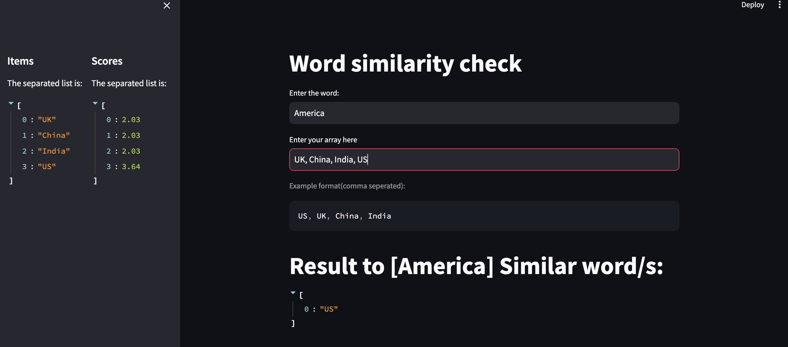

# pdfchat_phi2
---
 demo image



to run the streamlit app `streamlit run app.py`

You need to download `nltk corpus` dataset 
incase if you can't able to download it due to ' Certificate verify failed' error

run this in python command line
```
import nltk
import ssl

try:
    _create_unverified_https_context = ssl._create_unverified_context
except AttributeError:
    pass
else:
    ssl._create_default_https_context = _create_unverified_https_context

nltk.download()
```